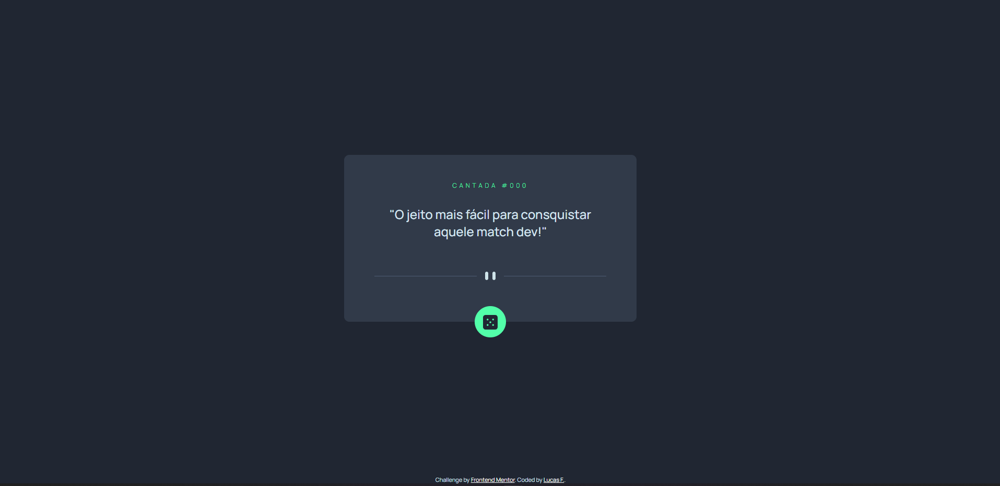

# Gerador de catadas dev

A ídeia é aproveitar a brincadeira com a comunidade dev para mostar um pouqinho do meu trabalho. Baseado no Advice generator app solution do [Frontend Mentor](https://www.frontendmentor.io)

## Conteudo

- [Overview](#overview)
  - [Screenshot](#screenshot)
- [My process](#my-process)
  - [Built with](#built-with)
- [Author](#author)
- [Acknowledgments](#acknowledgments)

## Overview

Para Acessar e conseguir conquistar a/o dev que vai dividir o café
com você, basta clicar **[AQUI](#)**

### Screenshot

## My process

### Built with

- HTML5
- CSS
- Javascript
- jQuery

## Author

- Website - [Lucas Ferrari](https://www.github.com/ferrarilucas)
- Twitter - [@ferrarilr](https://www.twitter.com/ferrarilr)

**Divirta-se!** 🚀
